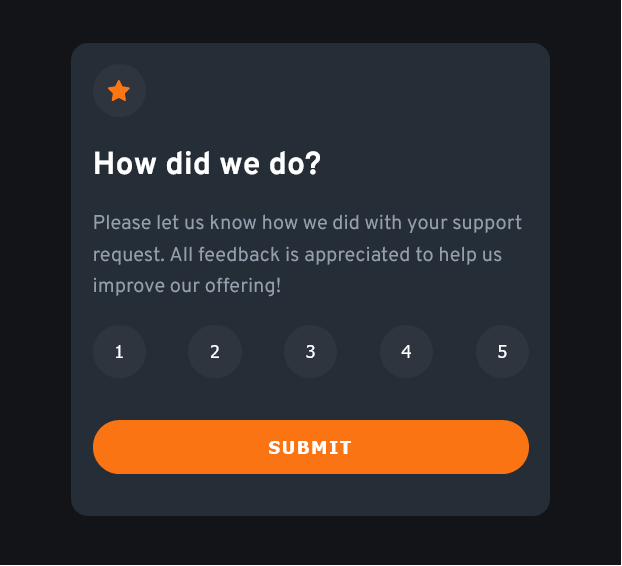

# Frontend Mentor - Interactive rating component solution

This is a solution to the [Interactive rating component challenge on Frontend Mentor](https://www.frontendmentor.io/challenges/interactive-rating-component-koxpeBUmI). Frontend Mentor challenges help you improve your coding skills by building realistic projects. 

## Table of contents

- [Overview](#overview)
  - [The challenge](#the-challenge)
  - [Screenshot](#screenshot)
  - [Links](#links)
- [My process](#my-process)
  - [Built with](#built-with)
- [Author](#author)

## Overview

### The challenge

Users should be able to:

- View the optimal layout for the app depending on their device's screen size
- See hover states for all interactive elements on the page
- Select and submit a number rating
- See the "Thank you" card state after submitting a rating

### Screenshot

### Links

- Solution URL: [Add solution URL here](https://github.com/webferrol/frontend-mentor-interactive-rating-component-main)
- Live Site URL: [Add live site URL here](https://rating-component-xurxo.netlify.app/)

## My process

### Built with

- Semantic HTML5 markup
- CSS custom properties
- Flexbox
- CSS Grid
- Mobile-first workflow

## Author

- Website - [WebFerrol](https://www.webferrol.com)
- Linkedin - [@weberrol](https://es.linkedin.com/in/webferrol?original_referer=https%3A%2F%2Fwww.google.com%2F)

## Accesibilidad
[Accesibilidad](https://classroom.google.com/c/NjAwOTIwNTc4NjAz?cjc=na6coqb)